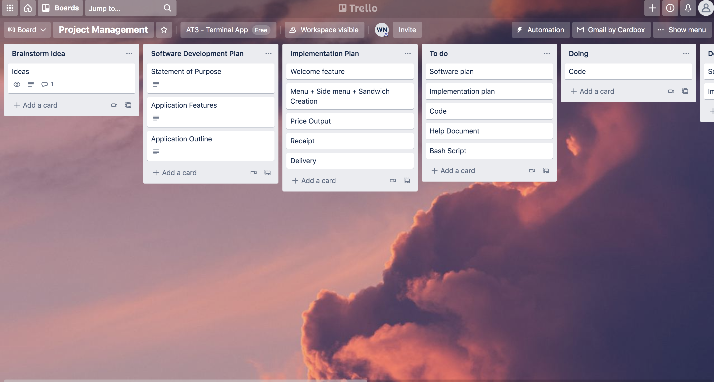
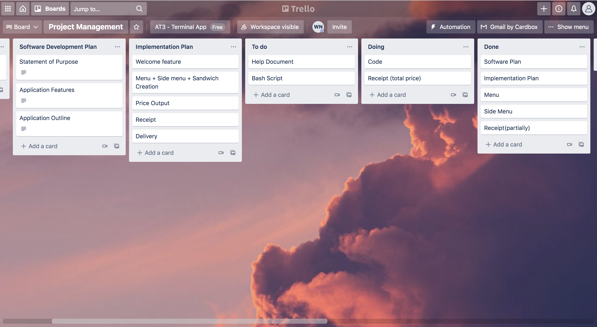
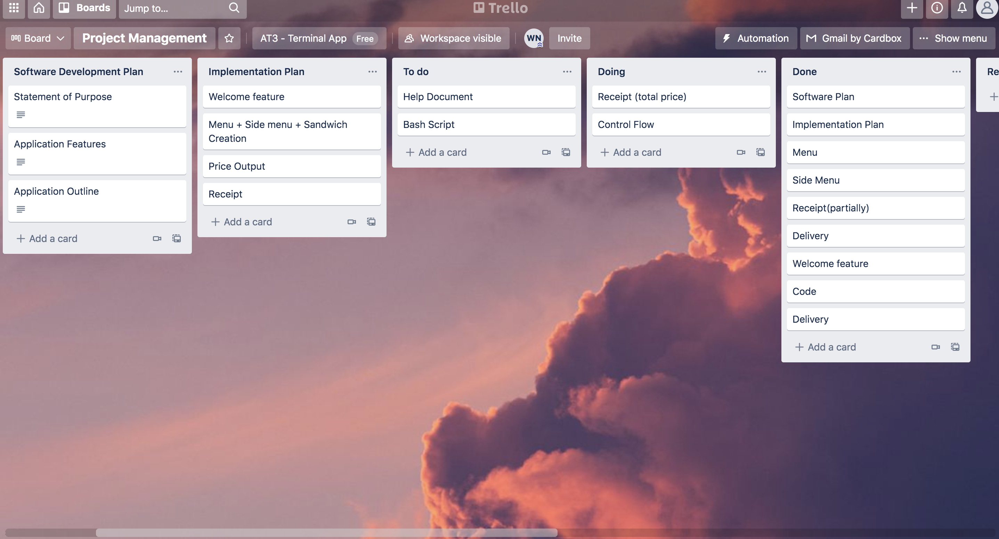
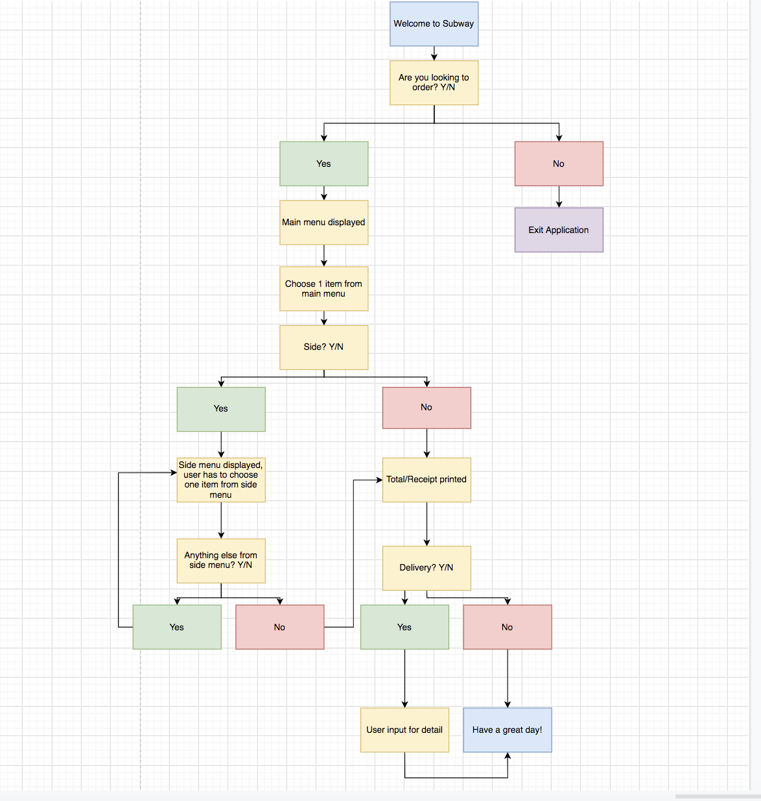

# **Software Development Plan**

### **_Statement of Purpose_**

####
The purpose of this terminal application is act as typical Subway simulation visit. Essentially, this is replicating a typical Subway store visit in real time, except this interaction is simulated with my terminal application. Essentially users can simulate a transaction where they choose what available sandwiches they want and also any additions from the side menu. The intended audience of this application are those who enjoy Subway on the regular and even those who want to know what it feels like to purchase a sandwich from visiting Subway.

### **_Application features_**

#### 
* Welcome feature
* Menu 
* Side menu
* Custom Sub Builder (SCRAPED)
* Price output/ Receipt Generator
* Delivery

### **_Outline_**
#### 
The intended user experience is that firstly, the application will welcome the user  and then ask if they would like to order. After that, a menu will pop up displaying the available sandwiches to purchase. Following that, the user will be prompted to what sandwich they want and then the application will ask if the user would want any additions from the side menu such as a drink or cookies. The program will keep on asking the user if they want additions on the side menu until they say "N", which means "no" to wanting to order anymore. Next, the total price is calculated and a receipt is printed on the screen. After that, the user would be prompted to if they want their order delivered or not. If they want their order delivered, they would they would be prompted to type in their information and this information will be saved and stored in a database.

# **Implementation Plan**
### **_Welcome Feature (lowest priority)_**
The "Welcome to Subway" message will be printed out in (hopefully) with cowsay. I plan on welcoming the customer with a turtle!
 
**Deadline:** Saturday

### **_Menu + Side Menu + Sub Creation (top priority)_**
I intend on creating the menu and side menu with lists. Following the menu and side menu, I will be creating a price menu just under it which can be referred back to later on throughout the selection process. Throughout the choosing process, the user will be prompted via user input to what they would like to add to their cart. Chosen items will be added together and a receipt will be printed out. Choosing one item from the main menu is mandatory, but choosing items off the side menu is completely optionally, therefore, the user is only required to select one item from the main menu and choosing items from the side menu is completely optional. 
 
**Deadline:** Thursday
**Update** : I removed the custom sub creation as it was too difficult for me to create, therefore I'm only including the menu and side menu being available to order.
**Status** : Complete

### **_Price Output (second priority)_** 
The price output will be calculted with a function(def), which takes all variables such as user input and adds up all chosen ingredients and extra additions on the side
 
**Deadline:** Friday
**Status** : Complete

### **_Receipt Generator (third priority)_**
The receipt generator will take the price output and print it on the user's screen
 
**Deadline:** Friday
**Status** Complete

### **_Delivery (fourth priority)_**
This delivery function will take user input, it would be including a name, address, and suburb(postcode). With the user input, it will print out after the receipt is already generated and then print on the user's screen their name, address, and suburb they entered as a confirmation. Through cowsay, hopefully the output of this message will be printed with a cow.
 
**Deadline:** Friday

# **Feature Tests**

# **Trello Board - Timeline**
Monday:

After Thursday (afternoon):

After Friday (noon):

Final:

Control Flow Diagram:

 
